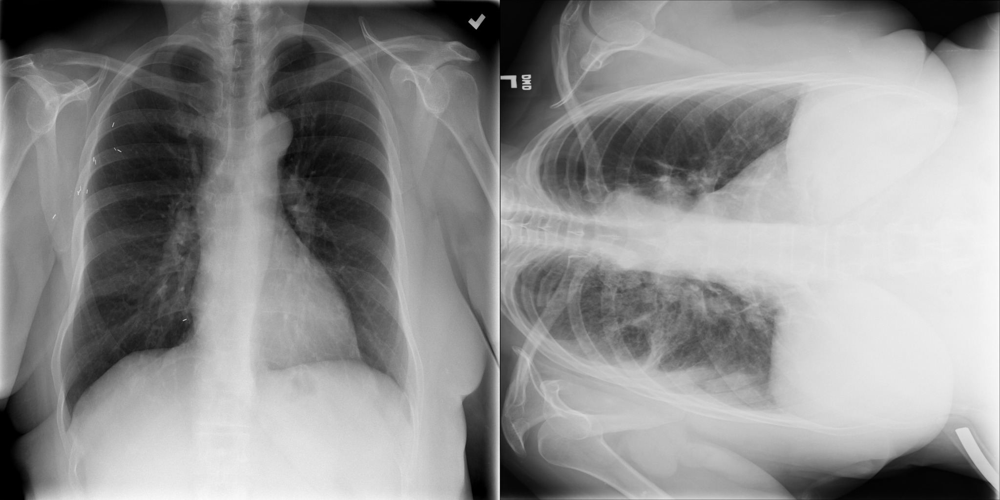

# Normal and 90-degree Rotated Chest X-ray Classification/Split

*Developed by Yuxing Tang (yuxing.tang@nih.gov), Imaging Biomarkers and Computer-Aided Diagnosis Laboratory,
National Institutes of Health Clinical Center*

This software provides a trained model to seperate the frontal view chest x-ray (CXR) into two categories: 
normal vertical and anti-clock wise 90-degree rotated. 

For example, a large number of CXRs in the PLCO dataset (https://biometry.nci.nih.gov/cdas/plco/) are left (anti-clock wise) 90-degree rotated, however, 
no meta data is available with the CXR image describing this. Here I provide a trained CNN model (ResNet18) to automatic seperate normal view CXRs and 
rotated ones.

### Prerequistites
- Linux or OSX
- NVIDIA GPU
- Python 2.7
- PyTorch v0.3 or later
- Numpy

## Usage
### Testing the sample images
(Image Source: NIH ChestXray14 https://nihcc.app.box.com/v/ChestXray-NIHCC)
1. Download the trained model in our Google Drive [here](https://drive.google.com/file/d/1FmUcTV8WRM24ZOLHbS9KX77ARNW-p4wr/view?usp=sharing) (85M).
2. Put the trained model into ./trained-models/
3. Run python run_test_samples.py
4. The images will be seperated into two individual folders, namely: images-0 with normal CXRs, and images-90 with 90-degree roatations.

### Testing your own images
1. Download the trained model in our Google Drive [here](https://drive.google.com/file/d/1FmUcTV8WRM24ZOLHbS9KX77ARNW-p4wr/view?usp=sharing) (85M).
2. Put the trained model into ./trained-models/
3. Create ./images/ folder and put your own images into this foler.
4. Generate a .txt file to include the image file names in shell command line: ls ./images/ > test_list.txt
5. Run: python run_test_own.py to test.
6. The images will be seperated into two individual folders, namely: images-0-own with normal CXRs, and images-90-own with 90-degree roatations.

### PLCO dataset
We provided the list of rotated CXRs in the PLCO dataset in PLCO-rotation-90.txt
