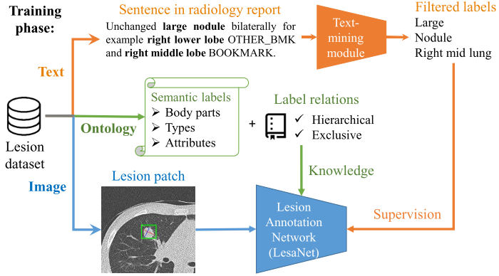
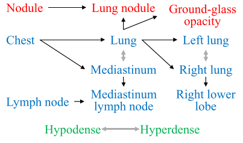
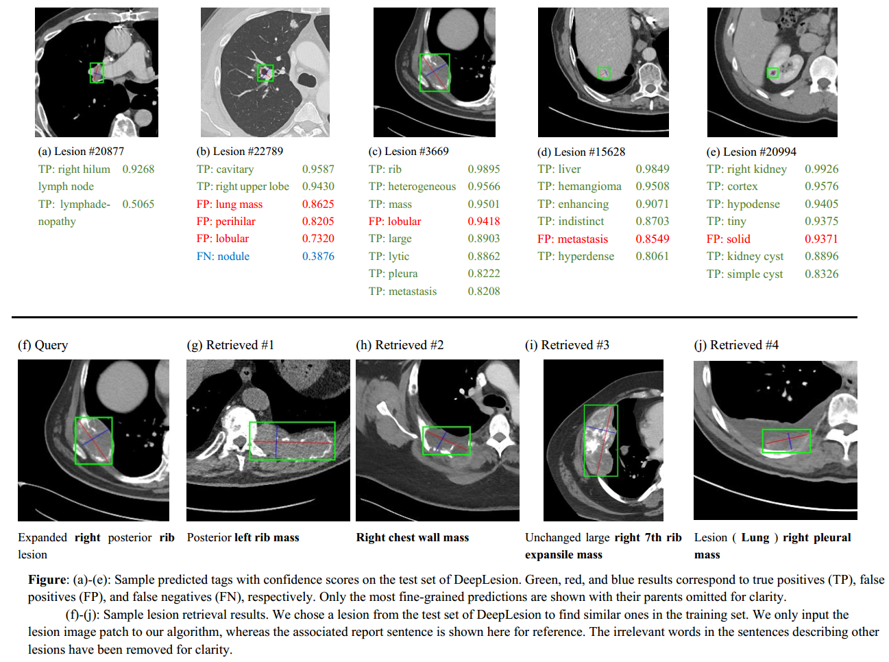

## Lesion annotation network (LesaNet)  
  
Developed by Ke Yan (yankethu@gmail.com, [yanke23.com](http://yanke23.com)), Imaging Biomarkers and Computer-Aided Diagnosis Laboratory, National Institutes of Health Clinical Center  
  
LesaNet [1] predicts the body part, type, and attributes of a variety of lesions in CT images. It is a multi-label classification CNN. It learns to annotate lesion images by leveraging radiology reports and the relations between labels (ontology).
  
You can use LesaNet to:
1. Given a lesion image patch, predict the lesion's body part, type, and attributes;
1. Given a label (e.g., kidney), find all lesions with that label in your database;
1. Given a lesion image patch, find similar lesions in your database (content-based image retrieval).  

_Framework and sample lesion ontology, see [1]:_
   
  
#### Requirements  
* PyTorch 0.4.1  
* Python 2.7  
* The DeepLesion dataset [2,3,4]  
* The roi_pooling layer, which can be forked from [faster-rcnn.pytorch](https://github.com/jwyang/faster-rcnn.pytorch/tree/master/lib/model/roi_pooling) and put in `roi_pooling/`
* `virtualenv_setup.sh` and `requirements.txt` can be used to build a virtual environment for LesaNet.  
  
#### Usage on DeepLesion
* You can train your own model or download the model in [1] from [here](https://nihcc.app.box.com/s/vbjermlyqlxee7s6pkbddlfu4mljf58w) and put it in `checkpoints/`.
    * Run `./run.sh` for both training and inference.  
    * Modify `default.yml` for configurations of training and inference.  
    * Modify `config.yml` for hyper-parameters of the algorithm.  
* With a trained model, you can set `mode='infer'` in `default.yml`. A Matlab `.mat` file will be saved in `results/` which contains the prediction results of the test set.  You can also set `generate_features_all=True`, which will produce a `.mat` file containing the embeddings of all lesions.  
* After the `.mat` files are generated, you can run `visualize_results.py` to generate a `.html` file to visualize the lesion classification and retrieval results.  
* This project is designed for the DeepLesion dataset. You can modify `dataset_DeepLesion.py` and `load_ct_img.py` to adapt to your own data.

#### Demo
* Requirement: a trained model, a nifti CT image (e.g., `demo.nii.gz`).
* Set `mode='demo'` in `default.yml`.
* Because we use lesion patches as the input, please specify the coordinates of the 2D bbox of the lesion in a text file
with the format of `slice_number, left, top, right, bottom`, see `demo_coords.txt` for an example.
* Run `./run.sh`, input the path of the image and text files. The predictions will be printed on the console with the image patch saved to `results/`.

#### Lesion labels and ontology (`program_data`)  
* `text_mined_labels_171_and_split.json`: Labels and data split. It contains several variables: `term_list` is the 171 labels used in [1]; `train/val/test_lesion_idxs` are the lesion indices of the train/val/test sets used in [1], where the indices are based on `DL_info.csv` in DeepLesion [2] starting from 0; `train/val/test_relevant/uncertain_labels` are the text-mined labels [1] from the reports of DeepLesion.  
* `lesion_ontology_181022.xlsx`: The ontology of the labels, including id (obsolete), class (bodypart/type/attribute), label name, synonyms, number of occurrence in DeepLesion, exclusive labels, parent labels, and child labels. The ontology is an adaptation of RadLex [5] v3.15 under the [license](https://www.rsna.org/uploadedFiles/RSNA/Content/Informatics/RadLex_License_Agreement_and_Terms_of_Use_V2_Final.pdf).
The 171 labels used in [1] is a subset of this ontology.  
* `hand_labeled_test_set.json`: 500 random lesions in the test set manually annotated by two radiologists in a more comprehensive fashion [1].  
* `labels_for_demo.xlsx`: The sizes, accuracies, and thresholds of the 171 labels on the hand-labeled test set.

#### Results  
  

#### Limitations  
* Because of the complexity of the free-text radiology reports and the limitation of the text-mining algorithm, the labels in `text_mined_labels_171_and_split.json` may contain noises.  
* Radiologists typically do not describe every label of a lesion in the report, so the labels in `text_mined_labels_171_and_split.json` may also be incomplete.
* The lesion ontology can be further refined by professionals.  
* LesaNet was trained on lesions in DeepLesion, so it may be inaccurate on nonlesions or lesions that are rare in DeepLesion.

#### References  
1. K. Yan, Y. Peng, V. Sandfort, M. Bagheri, Z. Lu, and R. M. Summers, “Holistic and Comprehensive Annotation of Clinically Significant Findings on Diverse CT Images: Learning from Radiology Reports and Label Ontology,” in CVPR, 2019. ([arXiv](https://arxiv.org/abs/1904.04661))  
1. The DeepLesion dataset. ([download](https://nihcc.box.com/v/DeepLesion))  
1. K. Yan, X. Wang, L. Lu, and R. M. Summers, “DeepLesion: Automated Mining of Large-Scale Lesion Annotations and Universal Lesion Detection with Deep Learning,” J. Med. Imaging, 2018. ([paper](http://yanke23.com/papers/18_JMI_DeepLesion.pdf))  
1. K. Yan et al., “Deep Lesion Graphs in the Wild: Relationship Learning and Organization of Significant Radiology Image Findings in a Diverse Large-scale Lesion Database,” in CVPR, 2018. ([arXiv](https://arxiv.org/abs/1711.10535))  
1. http://www.radlex.org/; https://bioportal.bioontology.org/ontologies/RADLEX