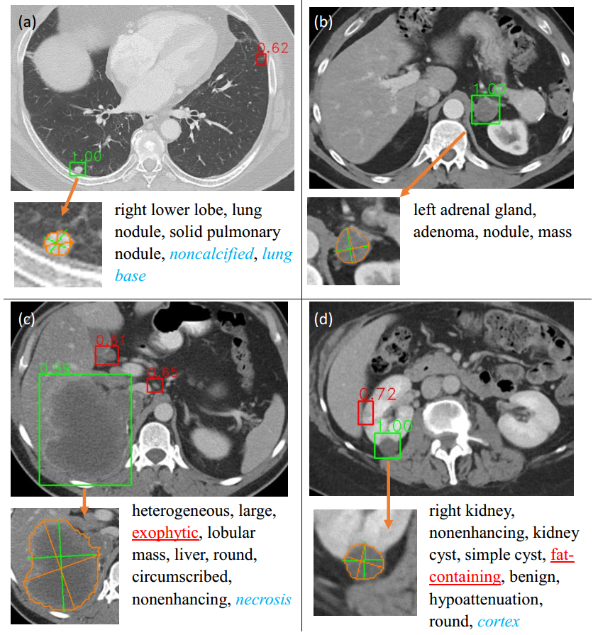
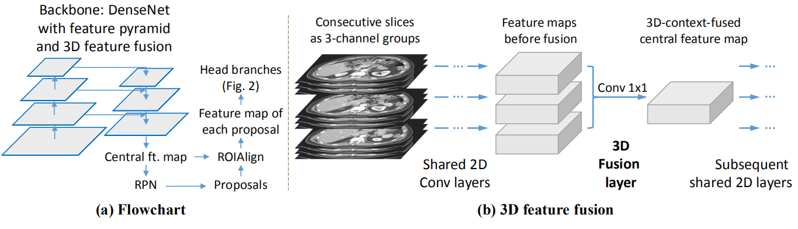
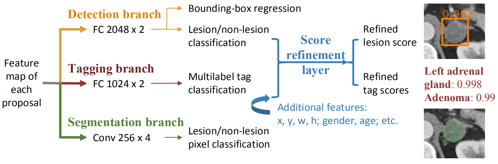

## Multitask Universal Lesion Analysis Network (MULAN)  

This project contains the code of the MICCAI 2019 paper: “MULAN: Multitask Universal Lesion Analysis Network for Joint Lesion Detection, Tagging, and Segmentation” [1].

Developed by Ke Yan (yankethu@gmail.com, [yanke23.com](http://yanke23.com)), Imaging Biomarkers and Computer-Aided Diagnosis Laboratory, National Institutes of Health Clinical Center.  
 
MULAN [1] can detect a variety of lesions in CT images, predict multiple tags (body part, type, attributes) for each lesion, and
segment it as well. It is designed based on the mask RCNN framework with a 3D feature fusion strategy and three head branches. It was trained on the DeepLesion [2,3] dataset. 

This code was adapted from Facebook's [maskrcnn-benchmark](https://github.com/facebookresearch/maskrcnn-benchmark). We thank them for their excellent project.

#### Sample results  

  

#### Requirements  
* PyTorch 1.1, torchvision 0.3.0  
* Python 3.6  
* If you just want to test our model, a MULAN model [1] trained on DeepLesion is [here](https://nihcc.box.com/s/agcs3orjctj981vyitwgrzaxcyx1qq71). you can put it in `checkpoints/`. Note that the released model does not have 
additional feature input (age, sex, etc.) in the refine layer, so its accuracy on DeepLesion is different from [1].
* If you want to train your own model, the DeepLesion dataset [2,3] is needed. Download it and modify the path in `paths_catalog.py`.
* To train the tag head, you also need the lesion tags and ontology (`text_mined_labels_171_and_split.json`, `lesion_ontology_181022.xlsx`, `hand_labeled_test_set.json`) from [here](https://github.com/rsummers11/CADLab/tree/master/LesaNet/program_data). Put the 3 files in the `program_data` folder.

#### Setup
1. `./setup.sh`
1. `source venv/bin/activate`
1. check `config.yml` to set mode (see below) and parameters;
1. `python run.py`

#### Modes
* __demo__: Use a trained checkpoint, input the path of a nifti image file in terminal, get prediction results (overlaid images) in the `results` folder.
* __batch__: Similar to __demo__, except that you input a folder that contains multiple nifti files. The predictions are stored in a PyTorch `pth` file. You can set some parameters of these two modes in `demo_batch_config.yml`.
* __train__: Train and validate MULAN on a dataset. Currently the codes are designed for the DeepLesion dataset.
* __eval__: Evaluate a trained model on DeepLesion.
* __vis__: Visualize test results on DeepLesion.

#### Limitations  
* Because of the complexity of the universal lesion analysis (detection + tagging + segmentation) task and the limitation of the training data, the results may still not be perfect. For example, lesion detection results may contain false positives (nonlesions that look like lesions).  
* MULAN was trained on lesions in DeepLesion, so it may be inaccurate on body regions and lesions that are rare in DeepLesion.

#### References  
1. K. Yan, Y. B. Tang, Y. Peng, V. Sandfort, M. Bagheri, Z. Lu, and R. M. Summers, “MULAN: Multitask Universal Lesion Analysis Network for Joint Lesion Detection, Tagging, and Segmentation,” in International Conference on Medical Image Computing and Computer Assisted Intervention (MICCAI), 2019. ([arXiv](https://arxiv.org/abs/1908.04373))
1. The DeepLesion dataset. ([download](https://nihcc.box.com/v/DeepLesion))  
1. K. Yan, X. Wang, L. Lu, and R. M. Summers, “DeepLesion: Automated Mining of Large-Scale Lesion Annotations and Universal Lesion Detection with Deep Learning,” J. Med. Imaging, 2018. ([paper](http://yanke23.com/papers/18_JMI_DeepLesion.pdf))  
1. K. Yan, Y. Peng, V. Sandfort, M. Bagheri, Z. Lu, and R. M. Summers, “Holistic and Comprehensive Annotation of Clinically Significant Findings on Diverse CT Images: Learning from Radiology Reports and Label Ontology,” in CVPR, 2019. ([arXiv](https://arxiv.org/abs/1904.04661))  

#### Network structure
Backbone:  
  

heads:  

  