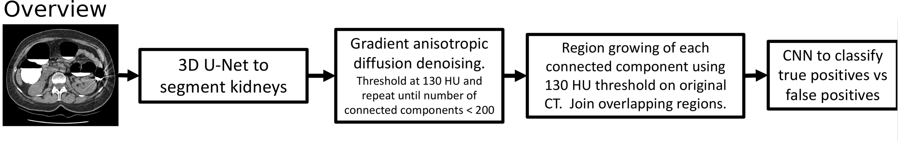

# Kidney stone detector

2020-2021, Daniel C. Elton

**Code is provided to ensure our method can be reproduced. The files containing the trained weights for the two deep learning models, normally stored under log/, are not included.**

This method is designed specifically for non-contrast CT.

If you use or build off this code, please cite the following work:

## Citation

Daniel C. Elton, Evrim B. Turkbey, Perry J. Pickhardt, Ronald M. Summers. "A deep learning system for automated kidney stone detection and volumetric segmentation on non-contrast CT scans". *Medical Physics*. 2022.

    @article{Elton2022KidneyStones,
    title = {A deep learning system for automated kidney stone detection and volumetric segmentation on non-contrast CT scans},
    journal = {Medical Physics},
    volume = {},
    issue = {},
    pages = {},
    year = {2022},
    doi = {},
    author = {Daniel C. Elton and Evrim B. Turkbey and Perry J. Pickhardt and Ronald M. Summers},
    }

## Usage

to run on multiple files:

`python detector.py --test_list filename_list.txt`

to run on a single file:

`python detector.py --single_file file.nii.gz`

## Optional arguments
`--test_list TEST_LIST` run on list of test images  
`--single_file SINGLE_FILE`   path to single .nii.gz file to run on  
`--result_root *some_directory*` , if specified saves results to directory specified (default is results/)    
`--offset X` apply offset to Houndsfeld units (ie `--offset -1024`)  (default is 0 offset)  
`--compute_test_metrics` for testing (requires ground truth kidney stone data in .json files)    
`--save_seg` saves the calculi segmentation to `calculi_seg_output/` directory (using 0.5 threshold)  
`--save_kidney_seg` saves the kidney segmentation to `kidney_seg_output/` directory (using 0.5 threshold)  
`--threshold X` set the initial threshold (default is 130 HU)  
`--offset OFFSET`       HU offset to apply (default = 0 )  
`--filename_tag FILENAME_TAG`  filename tag for testing results  
`--save_all_calculi_seg`  save all calculi prior to passing to CNN  
`--max_components MAX_COMPONENTS` denoising is done interatively until the number of detections (connected components) is less than this number. (Default 200)  
`--run_CNN`             Run CNN for false positive removal?  
`--operating_point OPERATING_POINT`  Operating point for the CNN (default is 0.5)  
`--min_calculi_volume MIN_CALCULI_VOLUME` minimum volume for calculi in mm^3 (default is 0.25)  

## Output

The kidney segmentations are automatically saved in kidney_seg_output.

There are two files outputted for each case:

### stone_sumary*.csv
contains a single line with the format:

`filename, max_score_in_case, binary_variable`

where `max_score` is the max score among kidney stone detections (if no detection it is 0)

`binary_variable` is either 0 or 1 depending on whether `max_score` was > 0.5

### stone_list*.csv
contains one line per kidney stone detected with the format:
`filename, score, centroid_x, centroid_y, centroid_z, volume (in mm^3), median_HU, average_HU, std_HU, max_HU, pole, l_or_r`

`pole` = 1 if the stone is in the upper half of the kidney, and = 0 if in the lower half
`l_or_r` is either "l" or "r" depending on whether the stone is in the patient's left or right

## Measuring kidney size
run

`python measure_kidney_sizes.py --test_list filename_list.txt`

or

`python measure_kidney_sizes.py --single_file file.nii.gz`

It will run inference_kidney_only.py and then measure volume (in cc) and output to a file. Use --save_csv_header to add the csv header to the output file.
